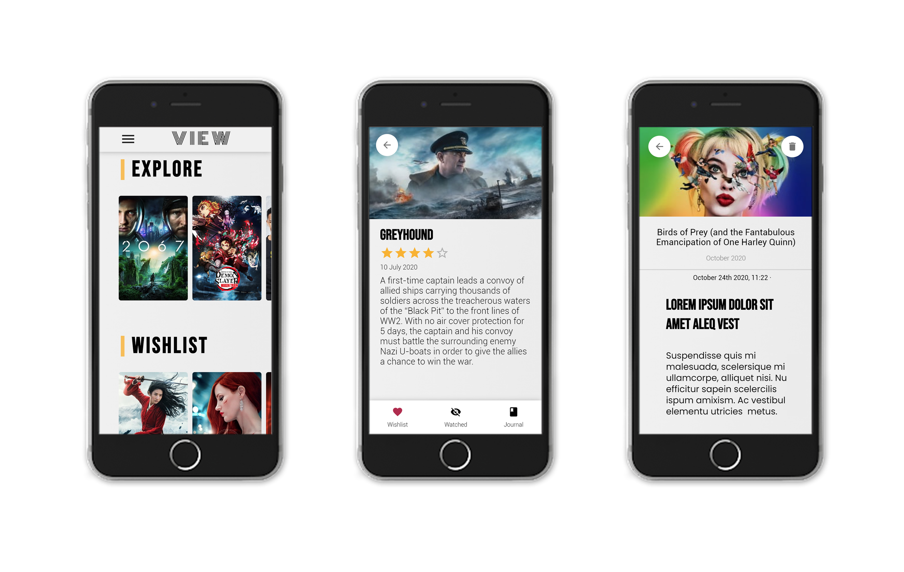

<p align="center">
  
</p>

# VIEW

VIEW is a responsive movie app with the nature of a diary book. Simply log in with your Google account, start the journey to explore, track and journal your movies. With VIEW, you can discover the latest releases, browse through different genres of movies and add them to your wish or watched lists. On top of that, you can create journal entries based on a particular movie that you have watched.

## Screenshots

### Mobile Preview

<div align="center">
  
</div>

### Desktop Preview

<div align="center">
    
</div>

## Getting Started

1. Clone the repo

```
git clone https://github.com/yw3028/VIEW.git
cd VIEW
```

1. Install dependencies in the root and in both client and server folders.

```
npm install
```

3. Create the database with postgres

4. Create `.env` file in `server/src` containing the following information (make sure that `DB_NAME` is the one from `step 3`)

```
HOST=
PORT=
DB_HOST=
DB_PORT=
POSTGRES_DB=
POSTGRES_USER=
POSTGRES_PASSWORD=
DB_NAME=
DB_USER=
DB_PASSWORD=
DOCKER=
NODE_ENV=
API_BASE_URL=http://movied.herokuapp.com
GOOGLE_CLIENT_ID=
JWT_SECRET=
JWT_EXPIRES_IN=
JWT_COOKIE_EXPIRES_IN=
```

For example:

```
HOST=localhost
PORT=3001
DB_HOST=localhost
DB_PORT=5432
POSTGRES_DB=movie_journal
POSTGRES_USER=postgres
POSTGRES_PASSWORD=secretpassword
DB_NAME=movie_journal
DB_USER=postgres
DB_PASSWORD=secretpassword
DOCKER=false
NODE_ENV=development
API_BASE_URL=http://movied.herokuapp.com
GOOGLE_CLIENT_ID=1023662076394-95opn7n5ukghrte51fmi7hdopd47bqio.apps.googleusercontent.com
JWT_SECRET=mysupersecretpassword4564789
JWT_EXPIRES_IN=90d
JWT_COOKIE_EXPIRES_IN=90
```

5. Start DB with docker

```
npm run start:db
```

6. Start back-end server

```
npm run start:server
```

7. Start development server

```
npm run start:client
```

## Tech Stack

### Frontend

- React
- Styled-components

### Backend

- Express
- Postgres
- Sequelize

### Special Ingredients

- Love ❤️
- Willingness to learn 🤓
- Team work 🙌

## Developers

- Jaume Fàbrega - [GitHub](https://github.com/jaumefapa) - [LinkedIn](https://www.linkedin.com/in/jaume-fabrega/)
- Jorge Macia - [GitHub](https://github.com/jmaciaa) - [LinkedIn](https://www.linkedin.com/in/jmaciasalord/)
- Yu Wang - [GitHub](https://github.com/yw3028) - [LinkedIn](https://www.linkedin.com/in/wang-y/)
